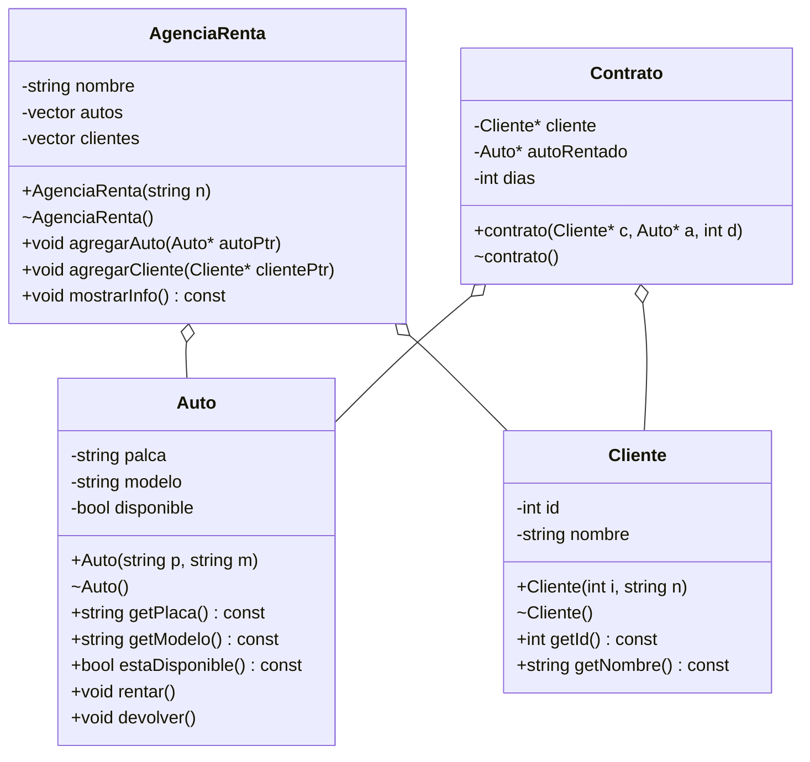

```mermaid
classDiagram

class Auto {
-string palca
-string modelo
-bool disponible
+Auto(string p, string m)
~Auto()
+string getPlaca() const
+string getModelo() const
+bool estaDisponible() const
+void rentar()
+void devolver()
}

class Cliente {
-int id
-string nombre
+Cliente(int i, string n)
~Cliente()
+int getId() const
+string getNombre() const
}

class Contrato {
-Cliente* cliente
-Auto* autoRentado
-int dias
+contrato(Cliente* c, Auto* a, int d)
~contrato()
}

class AgenciaRenta {
-string nombre
-vector<Auto*> autos
-vector<Cliente*> clientes
+AgenciaRenta(string n)
~AgenciaRenta()
+void agregarAuto(Auto* autoPtr)
+void agregarCliente(Cliente* clientePtr)
+void mostrarInfo() const
}

AgenciaRenta o-- Auto
AgenciaRenta o-- Cliente
Contrato o-- Auto
Contrato o-- Cliente

```
